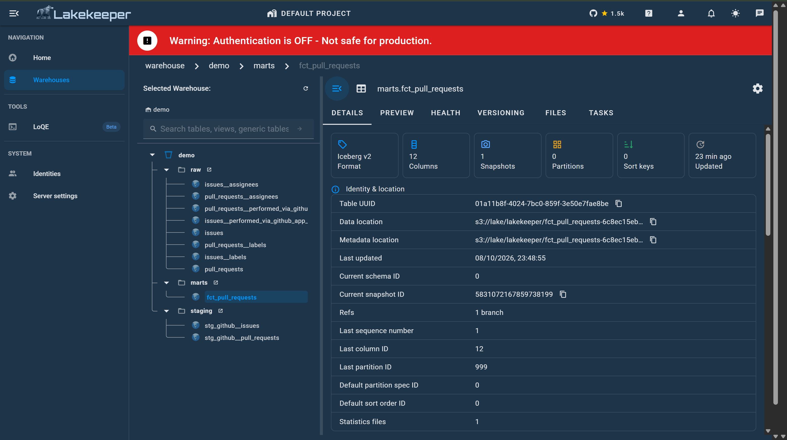
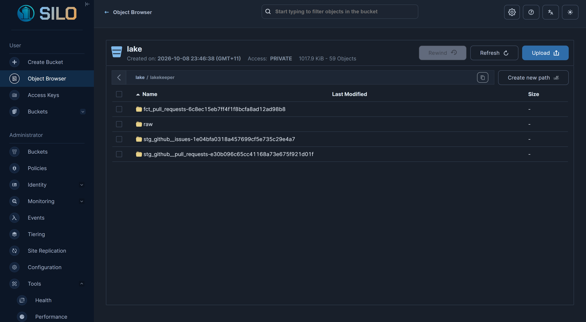
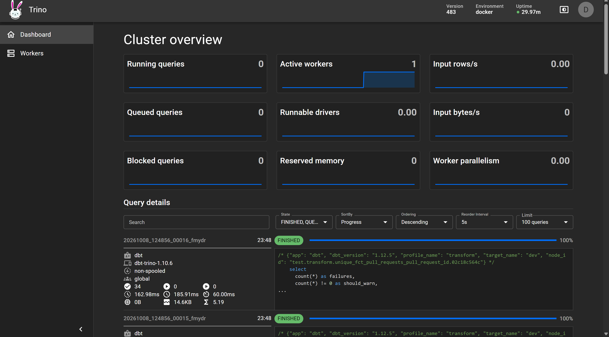

# Iceberg ELT demo

An ELT pipeline that keeps every table in Apache Iceberg. dlt loads issues and pull requests of five open-source repos from the GitHub API, dbt turns them into staging and mart tables with Trino as its engine, and Dagster runs both. Tables are Parquet files in MinIO, registered in Lakekeeper, an Iceberg REST catalog.

Everything runs in Docker. You don't need a GitHub token, cloud account or local Python.

<p align="center">
  
</p>

```
GitHub REST API
      │  dlt
      ▼
raw.issues, raw.pull_requests            ┐
      │  dbt on Trino                    │  Iceberg tables in MinIO (s3://lake/lakekeeper),
      ▼                                  │  registered in Lakekeeper (warehouse "demo")
staging.stg_github__issues, ...          │
      │  dbt on Trino                    │
      ▼                                  │
marts.fct_pull_requests                  ┘

Dagster runs the dlt and dbt steps as one job.
```

## Quickstart

You need Docker with Compose v2, about 6 GB of memory and 6 GB of disk for Docker, and ports 3000, 8080, 8181, 9000 and 9001 free. [infra/README.md](infra/README.md#prerequisites) lists the prerequisites and the measured requirements.

```bash
git clone <repo-url> iceberg-elt-demo
cd iceberg-elt-demo/infra
docker compose up -d
```

The first start builds the Dagster image, which takes a few minutes. Then open Dagster at http://localhost:3000, go to **Assets** and click **Materialize all**. The run loads the latest 100 issues and pull requests per repo, builds the dbt models and runs the dbt tests.

| UI | URL | What to look at |
|---|---|---|
| Dagster | http://localhost:3000 | Runs, the asset graph from `raw` to `marts`, dbt tests as asset checks |
| MinIO console | http://localhost:9001 | Data and metadata files under `lake/lakekeeper`. Log in with `minio-root-user` / `minio-root-password` |
| Lakekeeper | http://localhost:8181 | Catalog UI with the `raw`, `staging` and `marts` namespaces |
| Trino | http://localhost:8080 | The queries dbt sent, with their timings. Log in with any username, such as `admin`. There's no password. |

To stop, run `docker compose down`. Add `-v` to also delete the data, the catalog and Dagster's run history.

## What you'll see

### Dagster: the pipeline

The asset graph at the top of this page comes from Dagster's **Assets** view. The `ingest` group holds the tables dlt loads, and the `transform` group holds the dbt models, each tagged with Trino as its engine. dbt tests show up as asset checks on the models.

### Lakekeeper: the catalog



The `demo` warehouse lists every table by namespace. A table's page shows its Iceberg metadata: format version, schema, snapshots and the files' locations in MinIO. The **Preview** tab reads the table's files from MinIO in your browser.

### MinIO: the files



Every table is a folder of Parquet and metadata files under `lake/lakekeeper`. Lakekeeper names each dbt table's folder after the table plus an ID. The tables dlt loads sit under `raw`.

### Trino: the queries



Every statement dbt sends shows up here with its SQL and timings: model builds as `CREATE OR REPLACE TABLE ... AS` and tests as `select count(*) as failures ...`.

## Repository layout

| Folder | What it holds | Details |
|---|---|---|
| `extract_load/` | dlt pipeline that loads GitHub issues and PRs into `raw` | [extract_load/README.md](extract_load/README.md) |
| `transform/` | dbt project that builds `staging` and `marts` | [transform/README.md](transform/README.md) |
| `orchestrate/` | Dagster definitions: assets, the `elt` job, a daily schedule | [orchestrate/README.md](orchestrate/README.md) |
| `infra/` | Docker Compose stack: MinIO, Lakekeeper, Trino, Dagster | [infra/README.md](infra/README.md) |

`extract_load`, `transform` and `orchestrate` form one [uv](https://docs.astral.sh/uv/) workspace with a single lockfile. Running `uv sync` in the repo root gives your editor an environment for autocomplete and type checking. The pipelines themselves run in the Dagster container.
