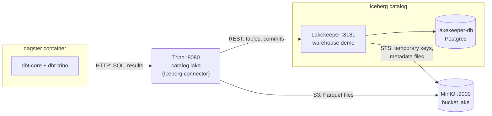
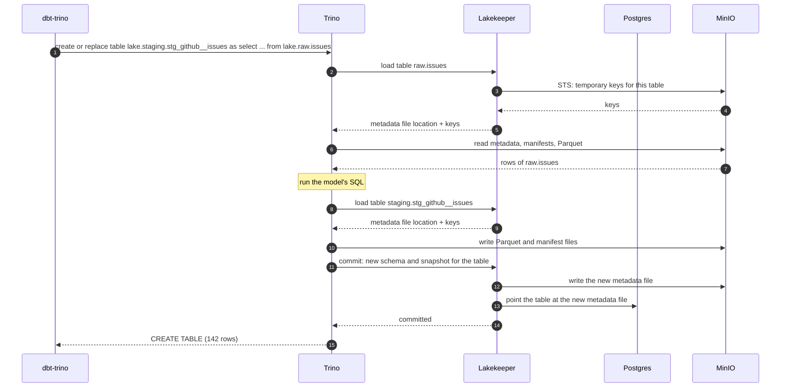
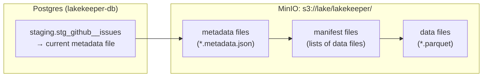

# How dbt talks to Iceberg

This page explains how this dbt project reads and writes Iceberg tables. It covers which service does what, what happens on the network when a model builds, where the files end up, and who holds which credentials. It's for anyone who has to change the dbt project or debug it. You should know what a dbt model is. You don't need to know Iceberg.

## The short version

dbt doesn't know Iceberg exists. dbt-trino sends every model's SQL to Trino, and Trino has the Iceberg catalog configured as a catalog called `lake`. When a model writes to `lake.staging.stg_github__issues`, Trino's Iceberg connector does the Iceberg work:

- it asks Lakekeeper, the catalog, which tables exist and where their files are;
- it reads and writes Parquet files in MinIO directly;
- it tells Lakekeeper to commit the change.

Lakekeeper never sees the table data. It keeps the list of tables, hands out temporary MinIO keys, and accepts commits.

## Iceberg in one paragraph

An Iceberg table is a folder of files in object storage, plus one pointer. The data sits in Parquet files. Metadata files list which Parquet files belong to the table right now, and which belonged to it in earlier versions, called snapshots. The catalog keeps the pointer, which maps each table name to the location of its current metadata file. A write adds new files, then asks the catalog to move the pointer. Moving the pointer is the commit, and it's atomic, so readers see either the old version or the new one. In this stack, MinIO stores the files and Lakekeeper is the catalog.

## The services



| Service | What it does | Configured in |
|---|---|---|
| dbt-core | Works out the model order, renders the SQL, runs tests | [dbt_project.yml](../dbt_project.yml) |
| dbt-trino | The dbt adapter. It sends SQL to Trino over HTTP and reads back the results. | [profiles.yml](../profiles.yml) |
| Trino | Runs the SQL in its own container. Its Iceberg connector speaks REST to Lakekeeper and S3 to MinIO. | `infra/docker-compose.yml`, `infra/trino/catalog/lake.properties` |
| Lakekeeper | The Iceberg REST catalog. It holds the table list and hands out temporary storage keys. | `infra/docker-compose.yml` |
| Postgres (`lakekeeper-db`) | Lakekeeper's own database: namespaces, tables, and the pointer to each table's current metadata file | `infra/docker-compose.yml` |
| MinIO | S3-compatible storage. Every data and metadata file lives in the `lake` bucket. | `infra/docker-compose.yml` |

The services share one network, so each reaches the others on `localhost`, the same addresses your machine uses ([infra/README.md](../../infra/README.md#networking) explains how). Trino reaches storage at `http://localhost:9000`, the address Lakekeeper also hands out. dbt runs in the `dagster` container and reaches Trino at `localhost:8080`.

## How Trino gets a `lake` catalog

Trino reads its catalogs from files at startup. [infra/trino/catalog/lake.properties](../../infra/trino/catalog/lake.properties) adds one called `lake`:

```properties
connector.name=iceberg
iceberg.catalog.type=rest
iceberg.rest-catalog.uri=http://localhost:8181/catalog
iceberg.rest-catalog.warehouse=demo
iceberg.rest-catalog.vended-credentials-enabled=true
fs.native-s3.enabled=true
s3.endpoint=http://localhost:9000
s3.region=local-01
s3.path-style-access=true
```

| Property | Meaning |
|---|---|
| `connector.name=iceberg` | Use Trino's Iceberg connector |
| `iceberg.catalog.type=rest` | The tables are registered in an Iceberg REST catalog |
| `iceberg.rest-catalog.uri` | Lakekeeper's REST address. Lakekeeper runs without login in this demo, and Trino's default is no authentication. |
| `iceberg.rest-catalog.warehouse` | The name of the Lakekeeper warehouse |
| `iceberg.rest-catalog.vended-credentials-enabled` | Use the temporary S3 keys Lakekeeper returns with each table |
| `fs.native-s3.enabled` | Read and write files with Trino's S3 file system |
| `s3.endpoint`, `s3.region`, `s3.path-style-access` | Where MinIO is and how to address it. They match the warehouse's storage profile in `infra/lakekeeper/create-warehouse.json`. |

[profiles.yml](../profiles.yml) points dbt-trino at Trino and sets `database: lake`, so dbt names every table `lake.<schema>.<table>`. [dbt_project.yml](../dbt_project.yml) sets `+database: lake` for every model as well. The [`generate_schema_name`](../macros/generate_schema_name.sql) macro keeps the schema names `staging` and `marts` as they are. Without it, dbt would build `main_staging` and `main_marts`.

Names line up like this:

| dbt | Trino | Lakekeeper |
|---|---|---|
| database `lake` | catalog `lake` | warehouse `demo` |
| schema `staging` | schema `lake.staging` | namespace `staging` |
| model `stg_github__issues` | table `lake.staging.stg_github__issues` | table `stg_github__issues` in namespace `staging` |
| source `github.issues` | table `lake.raw.issues` | table `issues` in namespace `raw` |

The `raw` tables must already be in the catalog when dbt runs. dbt only reads them.

## What happens when a model builds

Take `stg_github__issues`, which reads `raw.issues` and writes `staging.stg_github__issues`.

Every model uses dbt's `table` materialization with `on_table_exists: replace`. dbt-trino then sends one statement per model, `CREATE OR REPLACE TABLE ... AS`, for a first build and for every rebuild. Trino builds the new rows and commits them to the existing table as a new snapshot.

The diagram below is simplified. It leaves out list calls and lookups, and it shows the reads and the writes as single steps even though Trino splits them across several requests.



A few things to take from this:

- The heavy work happens in Trino. dbt only sends SQL and reads back the result.
- Trino reads and writes Parquet straight to MinIO, with keys that Lakekeeper got from MinIO's STS endpoint. The keys only work for the table they were issued for, and they expire.
- dbt's `ref()` and `source()` only produce names like `lake.raw.issues`. dbt never reads Iceberg metadata itself.
- The rebuild is one commit, so readers see the old snapshot until step 13 and the new one after it. The table never goes missing, and the old snapshot stays in its history.

## Where things are stored



| What | Where | Who writes it |
|---|---|---|
| Table names and namespaces | Postgres, through Lakekeeper | Lakekeeper, when Trino creates a table |
| Pointer to each table's current metadata file | Postgres | Lakekeeper, on every commit |
| Metadata files (schema, snapshots) | MinIO, under `s3://lake/lakekeeper/` | Lakekeeper, on every commit |
| Manifest files and Parquet data files | MinIO, next to the metadata | Trino |
| dbt artifacts (manifest, run results) | the dbt target folder, `transform/target/` unless `DBT_TARGET_PATH` says otherwise | dbt |

Lakekeeper picks the folder for each table under `s3://lake/lakekeeper`. To find a table's files, look up its location in the Lakekeeper UI at http://localhost:8181 instead of guessing a path from its name.

The warehouse `demo` was set up once, when the stack first started. Its config tells Lakekeeper which bucket and prefix to use, the MinIO endpoint, and the keys to use when it talks to MinIO.

## Who holds which keys

| Client | MinIO access | How it gets it |
|---|---|---|
| Lakekeeper | Root keys | Stored in the `demo` warehouse config |
| Trino | Temporary keys for one table | Lakekeeper requests them from MinIO's STS endpoint and returns them when Trino loads or creates a table |

This is why `lake.properties` has no S3 keys. Trino never sees the MinIO root keys. The warehouse setting `sts-enabled: true` turns this on.

Nobody logs in to Lakekeeper or Trino. That's fine for a local demo and wrong for anything shared.

## The `docs` target in CI

`.github/workflows/dbt-docs.yml` runs `dbt docs generate` on GitHub Actions, where no Trino, Lakekeeper or MinIO is running. It uses the `docs` target in [profiles.yml](../profiles.yml), which points at `localhost:8080`, and passes two flags so that dbt never connects:

- `--no-populate-cache` skips listing each schema's tables at the start of the run;
- `--empty-catalog` skips reading the tables' columns for the catalog.

Compiling models doesn't need the warehouse, so the lineage graph is complete. The catalog page has no column types, because no tables were read.

## Known limits

### Rebuilds

Every model is rebuilt with `CREATE OR REPLACE TABLE ... AS`, as described in [What happens when a model builds](#what-happens-when-a-model-builds). That's atomic, keeps the old table if the build fails, and keeps history. [iceberg-materialization.md](iceberg-materialization.md) has the tested details. The limits:

- Snapshots and their files pile up. Each rebuild adds about five files per model, and nothing expires old snapshots. Trino's `expire_snapshots` does, keeping at least seven days unless the session allows less.
- dbt-trino runs in autocommit mode, so post-hooks run after the replace has committed. A failing post-hook fails the model, and dbt skips its downstream models and tests, even though the table already has the new rows.
- dbt-trino doesn't run Python models.
- There are no incremental models. Every run rebuilds every table.
- Trino is a JVM service. Its container is capped at 3 GB of memory and used about 2 GB in testing.

### dbt-core 1.12 and dagster-dbt

The pipeline runs dbt through dagster-dbt, and dagster-dbt 0.29.25 requires `dbt-core<1.13`. So [pyproject.toml](../pyproject.toml) pins dbt-core 1.12, and the project can't move to dbt v2. Support for v2 in dagster-dbt is an open request, [dagster#34233](https://github.com/dagster-io/dagster/issues/34233). dbt-trino 1.10.6 supports dbt-core 1.12.
