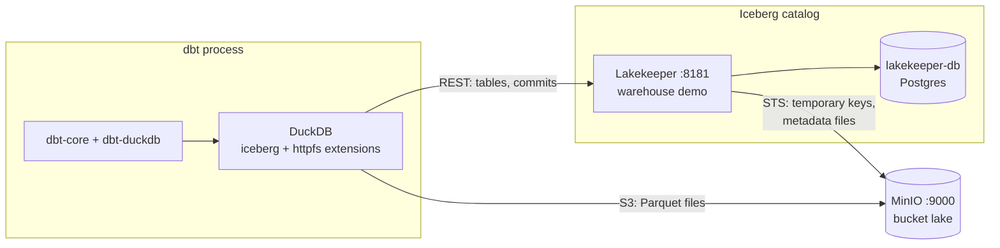
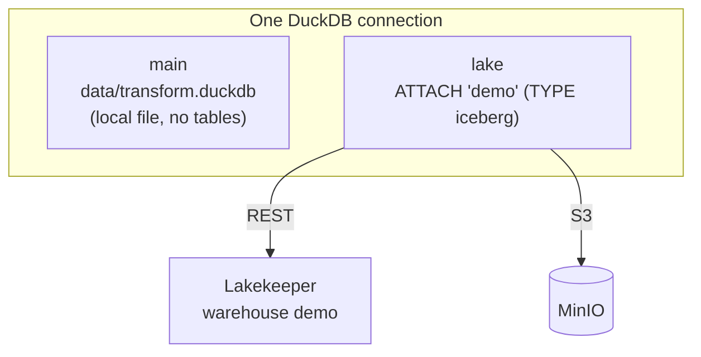
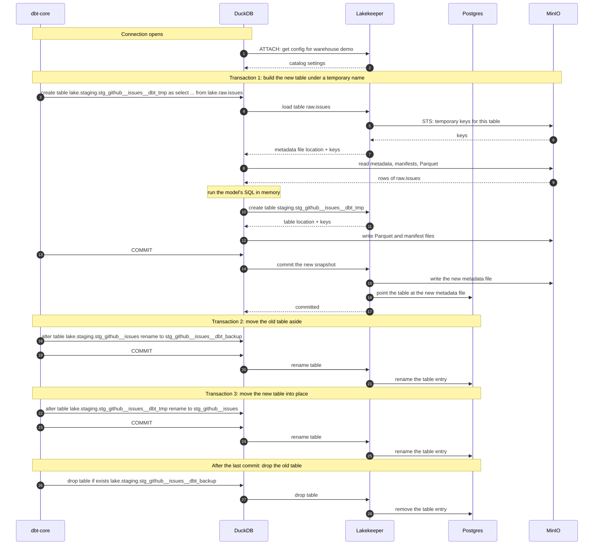
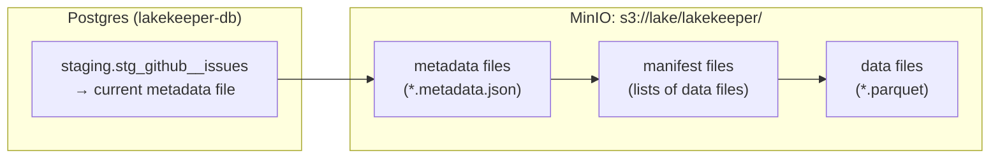
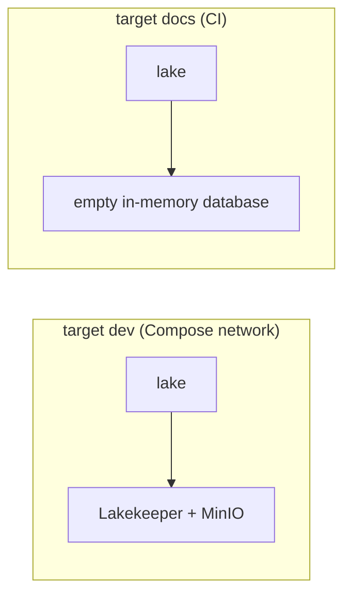

# How dbt talks to Iceberg

This page explains how this dbt project reads and writes Iceberg tables. It covers which service does what, what happens on the network when a model builds, where the files end up, and who holds which credentials. It's for anyone who has to change the dbt project or debug it. You should know what a dbt model is. You don't need to know Iceberg.

## The short version

dbt doesn't know Iceberg exists. dbt-duckdb hands every model's SQL to DuckDB, and DuckDB has the Iceberg catalog attached as a database called `lake`. When a model writes to `lake.staging.stg_github__issues`, DuckDB's `iceberg` extension does the Iceberg work:

- it asks Lakekeeper, the catalog, which tables exist and where their files are;
- it reads and writes Parquet files in MinIO directly;
- it tells Lakekeeper to commit the change.

Lakekeeper never sees the table data. It keeps the list of tables, hands out temporary MinIO keys, and accepts commits.

## Iceberg in one paragraph

An Iceberg table is a folder of files in object storage, plus one pointer. The data sits in Parquet files. Metadata files list which Parquet files belong to the table right now, and which belonged to it in earlier versions, called snapshots. The catalog keeps the pointer, which maps each table name to the location of its current metadata file. A write adds new files, then asks the catalog to move the pointer. Moving the pointer is the commit, and it's atomic, so readers see either the old version or the new one. In this stack, MinIO stores the files and Lakekeeper is the catalog.

## The services



| Service | What it does | Configured in |
|---|---|---|
| dbt-core | Works out the model order, renders the SQL, runs tests | [dbt_project.yml](../dbt_project.yml) |
| dbt-duckdb | The dbt adapter. It opens a DuckDB connection and sends it SQL. | [profiles.yml](../profiles.yml) |
| DuckDB | Runs the SQL in the same process as dbt. Its `iceberg` extension speaks to Lakekeeper and its `httpfs` extension speaks S3 to MinIO. | [profiles.yml](../profiles.yml) |
| Lakekeeper | The Iceberg REST catalog. It holds the table list and hands out temporary storage keys. | `infra/docker-compose.yml` |
| Postgres (`lakekeeper-db`) | Lakekeeper's own database: namespaces, tables, and the pointer to each table's current metadata file | `infra/docker-compose.yml` |
| MinIO | S3-compatible storage. Every data and metadata file lives in the `lake` bucket. | `infra/docker-compose.yml` |

dbt has to run in a container on the Docker Compose network. Lakekeeper tells clients to reach storage at `http://minio:9000`, and the name `minio` only resolves inside that network. Run from your own machine, dbt could reach Lakekeeper on `localhost:8181` but would fail to read or write any file.

## How dbt gets a `lake` database

DuckDB can have several databases open at once. dbt-duckdb opens two, both configured in [profiles.yml](../profiles.yml) under the `dev` target:



`path: data/transform.duckdb` is the main database. It's a local file that DuckDB needs for its session. No model is stored there.

The `attach` entry opens the second one. Each time dbt-duckdb opens a connection, it runs this:

```sql
ATTACH IF NOT EXISTS 'demo' AS lake (
    TYPE iceberg,
    ENDPOINT 'http://lakekeeper:8181/catalog',
    AUTHORIZATION_TYPE 'none'
);
```

| Option | Meaning |
|---|---|
| `path: demo` | The name of the Lakekeeper warehouse. For an Iceberg attach this is not a file path. |
| `alias: lake` | The name SQL uses. Every Iceberg table becomes `lake.<namespace>.<table>`. |
| `type: iceberg` | Use DuckDB's `iceberg` extension, which `extensions: [httpfs, iceberg]` loads. |
| `endpoint` | Lakekeeper's REST address inside the Compose network |
| `authorization_type: none` | Lakekeeper runs without login in this demo |

The attach goes straight through DuckDB. dbt-duckdb also has a plugin system, including an `iceberg` plugin built on PyIceberg, but this project doesn't use it. There's no `plugins:` key in the profile.

[dbt_project.yml](../dbt_project.yml) sets `+database: lake` for every model, so every model ends up in Iceberg. The [`generate_schema_name`](../macros/generate_schema_name.sql) macro keeps the schema names `staging` and `marts` as they are. Without it, dbt would build `main_staging` and `main_marts`.

Names line up like this:

| dbt | DuckDB | Lakekeeper |
|---|---|---|
| database `lake` | attached database `lake` | warehouse `demo` |
| schema `staging` | schema `lake.staging` | namespace `staging` |
| model `stg_github__issues` | table `lake.staging.stg_github__issues` | table `stg_github__issues` in namespace `staging` |
| source `github.issues` | table `lake.raw.issues` | table `issues` in namespace `raw` |

The `raw` tables must already be in the catalog when dbt runs. dbt only reads them.

## What happens when a model builds

Take `stg_github__issues`, which reads `raw.issues` and writes `staging.stg_github__issues`.

Every model uses dbt's built-in `table` materialization. It builds the new table under a temporary name and renames it into place. DuckDB won't rename an Iceberg table in the transaction that created it, and it rejects `DROP ... CASCADE` on Iceberg tables. So [macros/iceberg_relations.sql](../macros/iceberg_relations.sql) overrides dbt-duckdb's rename macro to commit first, and its drop macro to leave off `CASCADE`. A rebuild then takes three transactions and a final drop.

The diagram below is simplified. It leaves out list calls and lookups, and it shows the create and the write as one step even though DuckDB may split them across several requests.



A few things to take from this:

- The heavy work happens in DuckDB, inside the dbt process. Lakekeeper and MinIO only serve files and metadata.
- DuckDB reads and writes Parquet straight to MinIO, with keys that Lakekeeper got from MinIO's STS endpoint. The keys only work for the table they were issued for, and they expire.
- dbt's `ref()` and `source()` only produce names like `lake.raw.issues`. dbt never reads Iceberg metadata itself.
- Renames and drops only change Lakekeeper's records in Postgres. Files in MinIO stay where they are, including the dropped backup table's files.
- Between the commits of transactions 2 and 3, no table is called `stg_github__issues`. The window lasted tens of milliseconds in testing, but a query that lands in it fails. See [Known limits](#known-limits).

## Where things are stored



| What | Where | Who writes it |
|---|---|---|
| Table names and namespaces | Postgres, through Lakekeeper | Lakekeeper, when DuckDB creates, renames or drops a table |
| Pointer to each table's current metadata file | Postgres | Lakekeeper, on every commit |
| Metadata files (schema, snapshots) | MinIO, under `s3://lake/lakekeeper/` | Lakekeeper, on every commit |
| Manifest files and Parquet data files | MinIO, next to the metadata | DuckDB |
| DuckDB session file | `transform/data/transform.duckdb` | DuckDB. It holds no tables. |
| dbt artifacts (manifest, run results) | the dbt target folder, `transform/target/` unless `DBT_TARGET_PATH` says otherwise | dbt |

Lakekeeper picks the folder for each table under `s3://lake/lakekeeper`. To find a table's files, look up its location in the Lakekeeper UI at http://localhost:8181 instead of guessing a path from its name.

The warehouse `demo` was set up once, when the stack first started. Its config tells Lakekeeper which bucket and prefix to use, the MinIO endpoint, and the keys to use when it talks to MinIO.

## Who holds which keys

| Client | MinIO access | How it gets it |
|---|---|---|
| Lakekeeper | Root keys | Stored in the `demo` warehouse config |
| DuckDB | Temporary keys for one table | Lakekeeper requests them from MinIO's STS endpoint and returns them when DuckDB loads or creates a table |

This is why [profiles.yml](../profiles.yml) has no S3 secret. DuckDB never sees the MinIO root keys. The warehouse setting `sts-enabled: true` turns this on.

Nobody logs in to Lakekeeper (`authorization_type: none`). That's fine for a local demo and wrong for anything shared.

## The `docs` target in CI

`.github/workflows/dbt-docs.yml` runs `dbt docs generate --target docs` on GitHub Actions, where no Lakekeeper or MinIO is running. The `docs` target in [profiles.yml](../profiles.yml) attaches an empty in-memory database under the same name, `lake`:



Models still compile because `lake` exists, so the lineage graph is complete. The catalog page has no column types, because there are no real tables to read them from.

## Known limits

### Rebuilds

Every model uses dbt's `table` materialization with the overrides in [macros/iceberg_relations.sql](../macros/iceberg_relations.sql), as described in [What happens when a model builds](#what-happens-when-a-model-builds). [iceberg-materialization.md](iceberg-materialization.md) has the tested details.

- The table is missing for a moment during a rebuild. A query from another connection between the commits of the two renames fails with `Table with name ... does not exist!` instead of returning the old rows. In testing the window was under 0.1 s.
- If the model's SQL fails, the old table stays in place. If something fails after the old table was renamed to `__dbt_backup`, such as a post-hook or the second rename, the model's table stays missing until the next successful run. dbt skips the downstream models and tests.
- Snapshot history restarts on every run, because each run creates a new table. Iceberg time travel never reaches past the latest build.
- `persist_docs` fails, because DuckDB rejects comments on Iceberg tables, and the failure leaves the table missing. Grants, `partitioned_by` and `sorted_by` are ignored with a warning.
- Dropped tables' files stay in MinIO, so storage grows with every run.
- There are no incremental models. Every run rebuilds every table.

A rebuild with no gap that also keeps history has to come from one of three places:

- DuckDB adding atomic replace for Iceberg tables;
- a materialization that replaces a table's rows in one Iceberg commit, which nobody has tested here;
- a different dbt adapter whose engine replaces Iceberg tables in one commit, such as Trino or Spark.

### dbt-core 1.12 and dagster-dbt

The pipeline runs dbt through dagster-dbt, and dagster-dbt 0.29.25 requires `dbt-core<1.13`. So [pyproject.toml](../pyproject.toml) pins dbt-core 1.12, and the project can't move to dbt v2. Support for v2 in dagster-dbt is an open request, [dagster#34233](https://github.com/dagster-io/dagster/issues/34233).

Moving to dbt v2 would make rebuilds worse. Against an Iceberg REST catalog, v2's DuckDB `table` materialization drops the table, commits, and creates it again, so the table would be missing for the whole build. It would add built-in incremental models.
